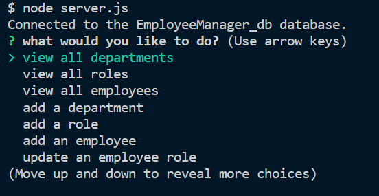
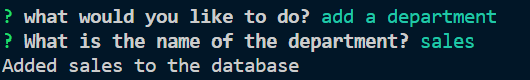
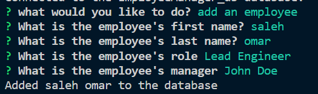
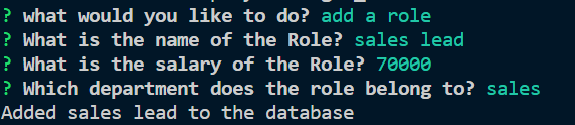
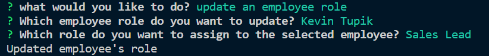

# employee-tracker

# Employee Tracker

## Description:

## \_Employee tracker made with Node.js and MYSQL. The user is prompted to answer questions, and the answers to the questions will view some tables, insert, or udate them.

## Table of Content:

1. [Installation Instructions](#installation)
2. [Usage Information](#usage)
3. [License Information](#License)
4. [Contribution](#contributing)
5. [Tests](#tests)
6. [Questions](#questions)

## installation:

## 1. run command "npm i in root folder to install dependancies"

## 2. run command "node server.js"

## 3. start filling out the information

## Usage:

## to be used to work with mysql tables throw the sql shell.

## License: N/A

## contributing:

## Tate, Justin

## Tests:

## N/A

## Questions:

you can finde my GitHub at:

## [wasim202](https://github.com/wasim202)

If you have any questions please email me at:

## wsmohd87@gmail.com

## [Video link](https://drive.google.com/file/d/1_8rEbfpPI8xi5pZnpOuBK0737ua8QV-J/view)
